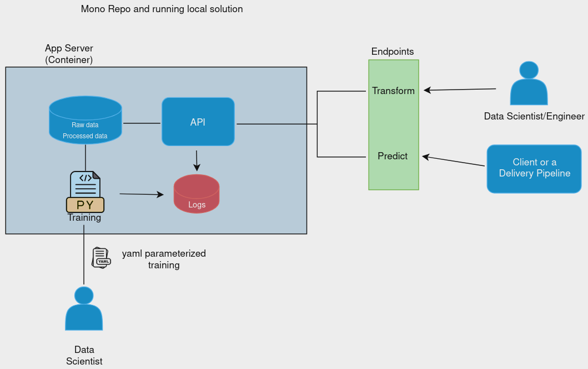

<h1 align="center"> CS_FD_MLENG - A simple case </h1>


---

### Table of Contents

- [Description](#description)
- [How to run](#how-to-run)
- [Training](#training)
- [Data Preparation](#data-preparation)
- [Quality Code](#quality-code)
- [Logging](#logging)
- [High Level Diagram](#high-level-diagram)

---

### Description

This repo is a case of how to productionize a machine learning model for fraud detection. It is a **Flask** API and has two endpoints:

- `/predict`: predict the probability of fraud
- `/transform`: transform the data to persist a training-ready dataset

The model is persisted in the `artifacts` folder. To run the model training, check the session [Training](#training)

---

### How to run

For now **the case is in development**. The sugestion is to build the docker image and run the container.

```bash
docker build -t project_tag .
```

After that, you can run the container with the following command:

```bash
docker run -it -p 5000:5000 image_name
```

NOTE: The model is currently persisted in the `artifacts` folder.

---

### Training

To train the model, you need to run the `train.py` script inside the `src/model` folder. The model training is **parameterized** by the `train_params.yaml` file in order to facilitate the experimenting process for data scientists. For our purpose, the training is divided for each **state**. In that sense, the main parameters are:

- Model: The model to be used. Currently, the model is **Logistic Regression**.
- State_Name: The name of the state.

Please, check the `train_params.yaml` file for more details.

---

### Data Preparation

An endpoint is defined to transform the data. The goal is to read the raw data and persist a training-ready dataset. Also, the encoder pickle file is persisted in the `artifacts` folder. An important reminder is that **the data is not versioned**. 

---

### Quality Code

For this project, we used the following tools:

- [isort](https://github.com/PyCQA/isort): sort imports
- [black](https://github.com/psf/black): format code

---

### Logging

The logging module is used to log the information of the application. Error information and the metrics are logged in the `app.log` file. The log file is located in the `src/logs` folder. NOTE: The log file is not versioned.

---

### High Level Diagram

