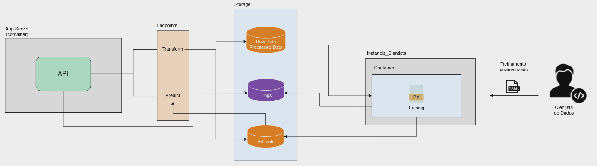

<h1 align="center"> CS_FD_MLENG - A simple case </h1>


---

### Table of Contents

- [Description](#description)
- [How to run](#how-to-run)
- [Training](#training)
- [Data Preparation](#data-preparation)
- [Quality Code](#quality-code)
- [Data Persistence](#data-persistence)
- [Logging](#logging)
- [High Level Diagram](#high-level-diagram)

---

### Description

This repo is a case of how to productionize a machine learning model for fraud detection. It is a **Flask** API and has two endpoints:

- `/predict`: predict the probability of fraud
- `/transform`: transform the data to persist a training-ready dataset

The model is persisted in the `artifacts` folder, which simulates a storage localtion to persist artifacts. To run the model training, check the session [Training](#training)

---

### How to run

In this example we have **two services**: 1) The Flask API to transform and predict the data; 2) The MySQL database to persist the prediction results. A docker compose file is provided to facilitate the deployment. Before running the compose file, you need to build the MySQL image. The Dockerfile for this image is located in the `src/data` folder.

```bash
docker build -t dbml .
```

After the building, you can run the compose file with the following command:

```bash
docker-compose up --build
```

The command above will create the two services. NOTE: The model is currently persisted in the `artifacts` folder.

Once the predict container is running, you can choose one of the **states** to prepare the data for training. At localhost:5000/transform endpoint use the following input (Chose the desired state. California is used as example): 

```json
{"state": "CA"}
```

A new file will be created in the `src/data/processed` folder. On a real production environment, this folder would be a storage location. The file is the training-ready dataset. To train the model, check the [Training](#training) section.

After the training is finished, you can use the `/predict` endpoint to predict the probability of fraud. At localhost:5000/predict use the following input as an example:

```json
{"trans_date_trans_time":"23-03-2019 01:09","merchant":"Greenholt, Jacobi and Gleason","category":"gas_transport","amt":9.94,"city":"Kaktovik","state":"AK","lat":66.6933,"long":-153.994,"city_pop":239,"job":"Careers information officer","dob":"01-04-1996","trans_num":"da81318af6e1918b067de24bbd9744d5","merch_lat":66.252098,"merch_long":-154.718147}
```

---

### Training

This solution suggests using a **multi repo** structure. For this reason, the training can be found in the repository at [this link](https://github.com/AlexandreH13/cs_fd_training/tree/main). However, to test the entire cycle (data transformation/preparation, training and prediction) the code for training the models was also left in this repository. But in a productive environment, **multi repo should ideally be used**.

The model training is **parameterized** by the `train_params.yaml` file in order to facilitate the experimenting process for data scientists. For our purpose, the training is divided for each **state**. In that sense, the main parameters are:

- Model: The model to be used. Currently, the model is **Logistic Regression**.
- State_Name: The name of the state.

Please, check the `train_params.yaml` file for more details.

To run an experiment, you can use the `train.sh` script:

```bash
./train_model.sh
```

---

### Data Preparation

An endpoint is defined to transform the data. The goal is to read the raw data and persist a training-ready dataset. Also, the encoder pickle file is persisted in the `artifacts` folder. An important reminder is that **the data is not versioned**. 

---

### Quality Code

For this project, we used the following tools:

- [isort](https://github.com/PyCQA/isort): sort imports
- [black](https://github.com/psf/black): format code

---

### Data Persistence

One of the services provided by this solution is the MySQL database. The database is used to persist the prediction results. The host name is `mysql` and the database name is `Db_Ml`, but you can change these values in the `docker-compose.yml` file.

NOTE: You also need to provide the credentials for the MySQL database, such as the username and password. These values are also defined in the `docker-compose.yml` file as environment variables.

---

### Debugging

You can execute the container to chec the log file.

```bash
docker exec -it predict bash
```

---

### Logging

The logging module is used to log the information of the application. Error information and the metrics are logged in the `app.log` file. The log file is located in the `src/logs` folder. NOTE: The log file is not versioned.

---

### High Level Diagram

